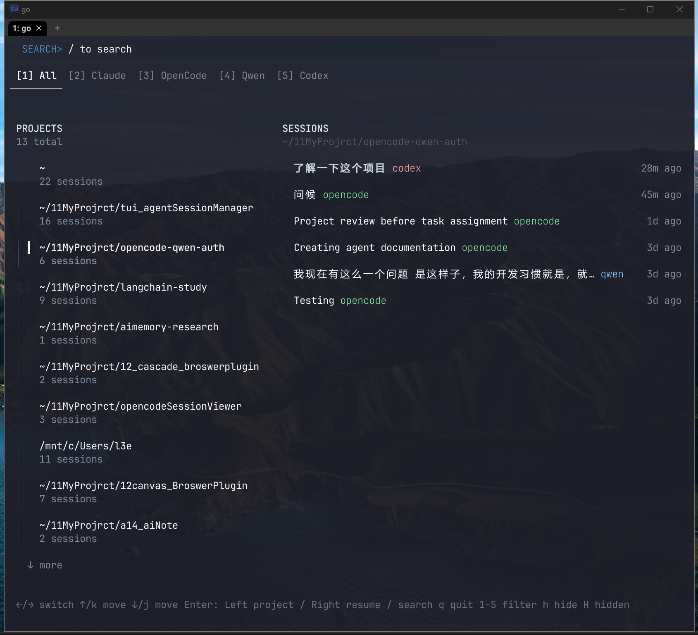

# Agent Session Manager

A Bubble Tea TUI for browsing and reopening AI coding sessions (Claude Code, OpenCode, Qwen, Codex).


## AI Quick Start (Copy to your AI agent)

If you want an AI agent to configure this tool for your machine, copy and paste this prompt:

```text
You are configuring Agent Session Manager for this machine. Read the README section "AI Auto-Config Protocol" and execute exactly this workflow: detect platform/shell, run `agent-manager --doctor --json` (or fallback `go run ./cmd/session-manager --doctor --json` when running from source), propose minimal env/config changes only (no source code edits), apply them, then re-run doctor and report final status plus exact diffs.
```

How to use:

1. Copy the prompt above.
2. Paste it into your AI agent chat in this repository.
3. Let the AI run the protocol, then review its reported diffs and doctor results.

## Status

This release is optimized for WSL-first workflows. The session restore path is:

1. Open a new Windows Terminal tab/window
2. Enter WSL shell
3. `cd` to the session project path
4. Run the restore command for the selected tool

## Quick Install (Global Command)

Install once, run anywhere (GitHub source):

Stable release (recommended):

```bash
npm i -g github:RunMintOn/SessionLens#v0.1.2
agent-manager
```

Latest default branch (bleeding edge, may be unstable):

```bash
npm i -g github:RunMintOn/SessionLens
agent-manager
```

No need to `cd` into this repo after install.
On first run, `agent-manager` auto-downloads the matching binary from GitHub Releases.

If npm is unavailable, use a prebuilt binary from GitHub Releases and place it in your PATH as `agent-manager`.

## Development Build and Run

```bash
go build -o /tmp/session-manager-mvp ./cmd/session-manager
/tmp/session-manager-mvp
```

## Keybindings

- `/`: enter search input mode
- `Esc` (in search mode): clear and exit search
- `Tab` or `Left/Right`: switch panel focus
- `Up/Down` or `k/j`: move cursor
- `Enter` (left panel): open selected project shell (double press within 2s)
- `Enter` (right panel): resume selected session
- `h`: hide selected session
- `H`: show hidden sessions overlay
- `1..5`: source filter (All, Claude, OpenCode, Qwen, Codex)
- `q`: quit

## Configuration (Environment Variables)

You can customize launcher behavior without changing source code.

- `ASM_TERMINAL_CMD` (default: `wt`)
- `ASM_TERMINAL_ARGS` (default platform-dependent, space-separated)
- `ASM_WSL_ENTRY_CMD` (default: `wsl.exe`)
- `ASM_WSL_SHELL` (default: `zsh -lic`)
- `ASM_HOST_SHELL_CMD` (default platform-dependent, usually `sh`)
- `ASM_HOST_SHELL_ARGS` (default platform-dependent, usually `-lc`)
- `ASM_RESTORE_CMD_CLAUDE` (default: `claude -r {id}`)
- `ASM_RESTORE_CMD_OPENCODE` (default: `opencode -s {id}`)
- `ASM_RESTORE_CMD_QWEN` (default: `qwen -r {id}`)
- `ASM_RESTORE_CMD_CODEX` (default: `codex resume {id}`)
- `ASM_CONFIG_PATH` (optional, override config file location)

Template placeholders:

- `{id}`: session ID (shell-quoted)
- `{project}`: project path (shell-quoted)

Example:

```bash
export ASM_WSL_SHELL="bash -lc"
export ASM_RESTORE_CMD_QWEN="qwen --resume {id}"
```

Install/bootstrap-specific environment variables:

- `ASM_RELEASE_REPO` (override GitHub release repo, format `OWNER/REPO`)
- `ASM_RELEASE_TAG` (pin a release tag, e.g. `v0.1.2`)
- `ASM_RELEASE_BASE_URL` (use custom release mirror base URL)
- `ASM_SKIP_BOOTSTRAP=1` (disable first-run binary download)

## Config File

Default config file path:

- Linux/WSL/macOS: `~/.config/agent-session-manager/config.json`
- Or override with `ASM_CONFIG_PATH`

Example config:

```json
{
  "terminal_cmd": "wt",
  "terminal_args": [],
  "wsl_entry_cmd": "wsl.exe",
  "wsl_shell": "zsh -lic",
  "host_shell_cmd": "sh",
  "host_shell_args": ["-lc"],
  "restore_cmd_claude": "claude -r {id}",
  "restore_cmd_opencode": "opencode -s {id}",
  "restore_cmd_qwen": "qwen -r {id}",
  "restore_cmd_codex": "codex resume {id}"
}
```

Priority:

1. `ASM_*` environment variables
2. Config file
3. Built-in defaults

## Doctor Mode

Run a quick environment and launcher configuration check:

```bash
agent-manager --doctor
# or (repo/dev mode): go run ./cmd/session-manager --doctor
```

Machine-readable report:

```bash
agent-manager --doctor --json
# or (repo/dev mode): go run ./cmd/session-manager --doctor --json
```

The report includes:

- active launcher configuration
- config value sources (`env` / `file` / `default`)
- config file path
- WSL detection
- terminal binary discovery
- Windows interop status
- command availability for configured restore tools
- structured fix suggestions

Print current effective config (after default + file + env merge):

```bash
agent-manager --print-effective-config
# or (repo/dev mode): go run ./cmd/session-manager --print-effective-config
```

Generate starter config:

```bash
# dry-run (prints target path + JSON)
agent-manager --init-config

# write file
agent-manager --init-config --write

# overwrite existing file
agent-manager --init-config --write --force
```

## AI Auto-Config Protocol

Use this section if an AI agent should configure the tool for a user.

Scope constraints:

- Allowed: user shell/profile env vars and user config file.
- Not allowed: patching source code for per-user setup.
- Not allowed: unrelated system/package changes unless user confirms.

Inputs the AI must use:

- Platform/shell signals (`uname -a`, `$SHELL`, `$WSL_DISTRO_NAME`).
- Doctor outputs (`--doctor` and `--doctor --json`).
- Existing user config path and current env vars.

Steps:

1. Detect platform and shell (`uname -a`, `$SHELL`, `echo $WSL_DISTRO_NAME`).
2. Run doctor:
   ```bash
   agent-manager --doctor
   agent-manager --doctor --json
   ```
3. Decide minimal changes:
   - Read JSON `checks` and `suggestions`.
   - If terminal missing, set `ASM_TERMINAL_CMD`.
   - If tool command missing, update `ASM_RESTORE_CMD_*` or user PATH.
   - If shell mismatch, set `ASM_WSL_SHELL` or `ASM_HOST_SHELL_CMD/ARGS`.
4. Initialize config template:
   ```bash
   agent-manager --init-config
   ```
5. Write config to either:
   - shell profile (`~/.zshrc`, `~/.bashrc`), or
   - `~/.config/agent-session-manager/config.json`
6. Re-run doctor and verify all required commands are `ok`.

Required AI output contract:

- detected platform and shell
- chosen change path (env vars or config file)
- exact changes applied (before/after or patch-style diff)
- final doctor status (`ok`/`fail`) and any remaining blockers

Success criteria:

- doctor reports terminal command and restore tool command as available.
- resuming a sample session works from the right panel.

## Troubleshooting

- `wt not found`: install Windows Terminal or set `ASM_TERMINAL_CMD`.
- `windows interop unavailable`: WSL cannot spawn Windows processes in current environment.
- `qwen: not found` (or similar): ensure command is available in configured shell, or override restore command via `ASM_RESTORE_CMD_*`.
- `bootstrap failed` on first run: check network access to GitHub, or pin a valid release tag:
  - `ASM_RELEASE_TAG=v0.1.2 agent-manager`
  - `ASM_RELEASE_BASE_URL=<mirror-url> agent-manager`

## Tests

```bash
go test ./...
```

## Release Automation (Maintainers)

This repo includes a tag-based release pipeline (`.github/workflows/release.yml`):

1. Push a tag like `v0.1.2`.
2. CI builds and uploads:
   - `agent-manager-linux-amd64`
   - `agent-manager-windows-amd64.exe`
   - `checksums.txt`
3. Users can install:
   - stable tag: `npm i -g github:RunMintOn/SessionLens#vX.Y.Z`
   - latest default branch: `npm i -g github:RunMintOn/SessionLens`
